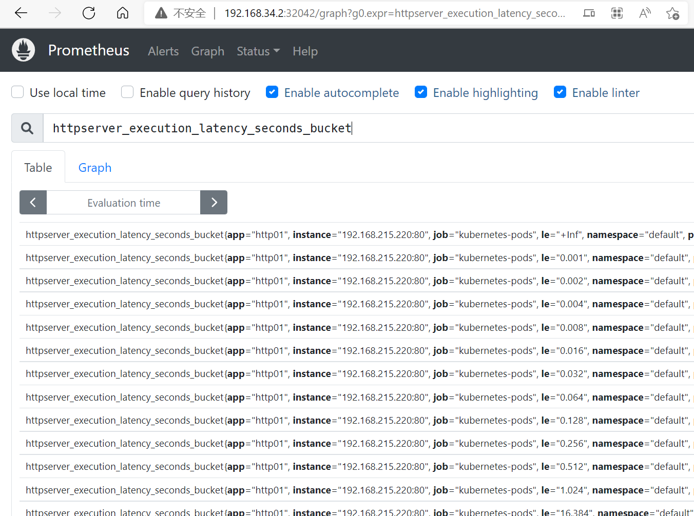
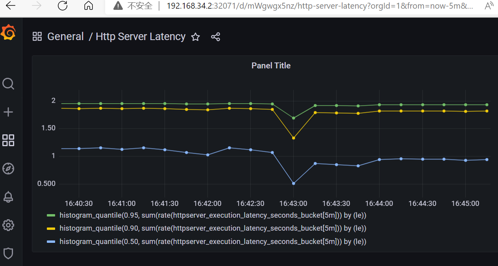

1.为 HTTPServer 添加 0-2 秒的随机延时；

```azure
make build
kubectl create -f dp.yaml
for i in {1..100};do curl 10.107.96.74;done
```

2. 为 HTTPServer 项目添加延时 Metric；

3. 将 HTTPServer 部署至测试集群，并完成 Prometheus 配置；

4. 从 Promethus 界面中查询延时指标数据；


5. （可选）创建一个 Grafana Dashboard 展现延时分配情况。



6. 疑问：