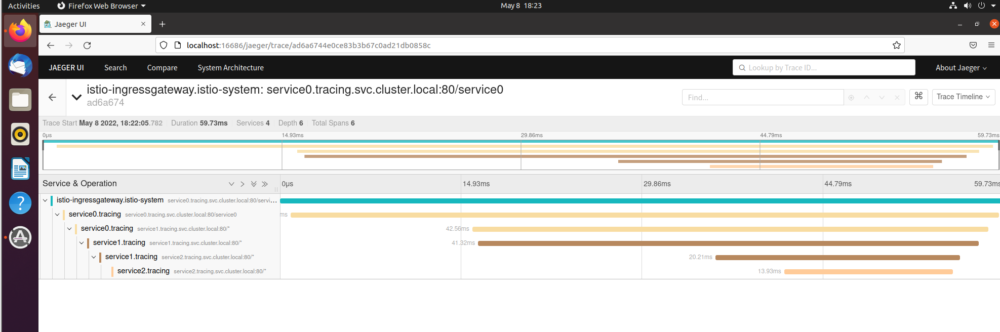

### 作业要求
把我们的 httpserver 服务以 **Istio Ingress Gateway** 的形式发布出来。

* 以istio-gateway的方式发布
  ```shell
  kubectl create ns httpistio
  kubectl apply -f port.yaml -n httpistio
  kubectl create -f dp.yaml -n httpistio
  kubectl create -f istio-spec.yaml -n httpistio
  # 查询istio-ingressgateway的地址
  k get svc -n istio-system
  export INGRESS_IP=192.168.164.201
  curl -H "Host: http.mgumm.com" $INGRESS_IP/ -v  
  # 其他命令
  k get vs
  k get gw
  k -n istio-system logs 
  ```
* 如何实现安全保证；
  * 业务只要实现http即可，tls由istio提供
  * 在gateway 将协议改成https，然后配置证书
  * ```shell
    # 创建证书
    openssl req -x509 -sha256 -nodes -days 365 -newkey rsa:2048 -subj '/O=mgumm Inc./CN=*.mgumm.com' -keyout mgumm.com.key -out mgumm.com.crt
    # 注意是放到istio-system下
    kubectl create -n istio-system secret tls mgumm-cert --key=mgumm.com.key --cert=mgumm.com.crt
    k get secret -n istio-system
    kubectl delete -f istio-spec.yaml -n httpistio
    kubectl create -f istio-spec3.yaml -n httpistio
    # --resolve HOST:PORT:ADDRESS 将 HOST:PORT 强制解析到 ADDRESS
    curl --resolve http.mgumm.com:443:$INGRESS_IP https://http.mgumm.com/ -v -k
    ```
* 七层路由规则；
  * 七层路由，讲的是路径匹配吗：比如http://域名/simple 匹配simple svc，比如http://域名/nginx匹配nginx svc
  * 如果是这样就使用match 匹配规则，匹配两个
  * ```shell
    k create -f nginx.yaml -n httpistio
    k delete -f istio-spec.yaml -n httpistio
    k create -f istio-spec2.yaml -n httpistio
    
    curl -H "Host: http.mgumm.com" $INGRESS_IP/http -v
    curl -H "Host: http.mgumm.com" $INGRESS_IP/nginx -v
    
    如果加上tls后需要这样访问
    curl --resolve http.mgumm.com:443:$INGRESS_IP https://http.mgumm.com/http -v -k
    curl --resolve http.mgumm.com:443:$INGRESS_IP https://http.mgumm.com/nginx -v -k

    ```
* 考虑 open tracing 的接入。
  * 将原来的go程序，改成嵌套调用，并将header 往下传递，这样可以很直观的查看
  * istioctl dashboard jaeger 查看
  * 

